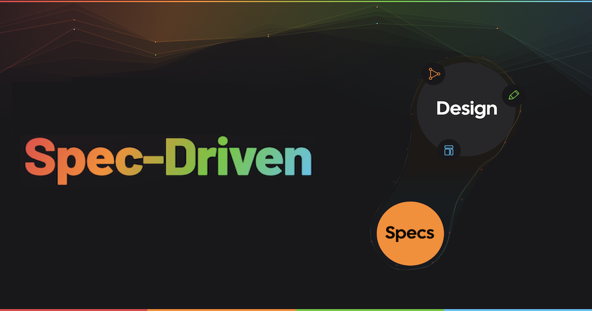

<p align="center">
  <a href="https://specdriven.com">
    
  </a>
</p>

<h3 align="center">Specifications are the new programming languages.</h3>

<p align="center">
  <a href="https://specdriven.com"><strong>specdriven.com</strong></a> ·
  <a href="https://specdriven.com/manifesto">Manifesto</a> ·
  <a href="https://specdriven.com/dialects/">Dialects</a> ·
  <a href="https://discord.com/invite/B8BKcKMRm8">Discord</a>
</p>

---

AI writes code faster than ever. The quality has never been worse.

**50% of all software defects originate at the specification stage**, before a single line of code is written. AI didn't create this problem, but it's pouring gasoline on it. Prompt-to-app tools skip the specification stage entirely, going straight from a vague idea to running code.

**Spec-Driven Development** is the paradigm that puts specifications first. Explicit. Persistent. Structured. Executable. Not as bureaucratic overhead, but as the shortest path to software that actually does what you intended.

## What's on the site

| Page                                                        | What you'll learn                                              |
| ----------------------------------------------------------- | -------------------------------------------------------------- |
| [Why Spec-Driven?](https://specdriven.com/why)              | The quality crisis AI is accelerating                          |
| [What Are Specifications?](https://specdriven.com/what)     | Specifications are the communication of design                 |
| [The Manifesto](https://specdriven.com/manifesto)           | The full thesis: Understanding → Design → Specification → Code |
| [Spec Dialects](https://specdriven.com/dialects/)           | Purpose-built specification languages for different domains    |
| [Quality & Specifications](https://specdriven.com/quality/) | Why 85% of bugs come from specification problems               |
| [Auto](https://specdriven.com/auto)                         | The spec-driven platform for building software                 |

## Contribute

This site is a community effort. Every page has an **Edit this page on GitHub** link at the bottom.

- **Fix something**: See a typo, an unclear sentence, a broken link? Open a PR.
- **Add a spec dialect**: Building a structured specification language? [Read the criteria](https://specdriven.com/community) and submit it.
- **Join the conversation**: [Discord](https://discord.com/invite/B8BKcKMRm8) is where the community gathers.

## Run locally

```bash
npm install
npm run dev
```

## License

Content is open source. Built with [VitePress](https://vitepress.dev).

An initiative by [Auto](https://on.auto).
