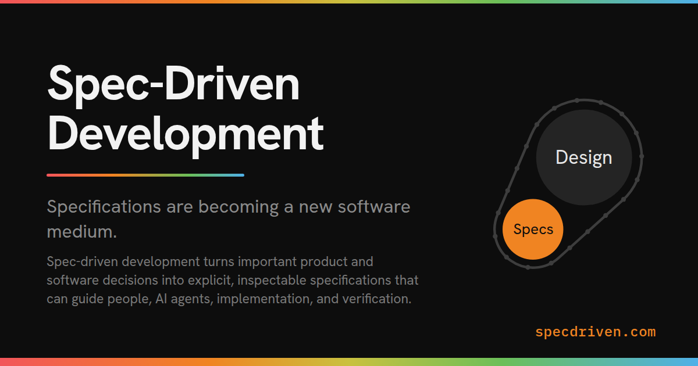

<p align="center">
  <a href="https://specdriven.com">
    
  </a>
</p>

<h3 align="center">Code can be generated. The important decisions still have to be made.</h3>

<p align="center">
  <a href="https://specdriven.com"><strong>specdriven.com</strong></a> ·
  <a href="https://specdriven.com/manifesto">Manifesto</a> ·
  <a href="https://specdriven.com/dialects/">Approaches & Formats</a> ·
  <a href="https://specdriven.com/landscape/">Landscape</a> ·
  <a href="https://specdriven.com/about">About Sam</a>
</p>

---

[specdriven.com](https://specdriven.com) is [Sam Hatoum's](https://specdriven.com/about) publication about spec-driven development. It covers [why specifications matter](https://specdriven.com/why), [what they are](https://specdriven.com/what), the [manifesto](https://specdriven.com/manifesto), [approaches and formats](https://specdriven.com/dialects/), the [tool landscape](https://specdriven.com/landscape/), and practical [discovery techniques](https://specdriven.com/guides/discovery-techniques).

Sam also founded [Auto](https://on.auto). Auto is covered on SpecDriven as one participant in the field; it does not publish this site.

This repo is the source for the site. Go read it, then come back here to help make it better.

## Contribute

Every page on the site has an **Edit this page on GitHub** link at the bottom.

- **Fix something**: See a typo, an unclear sentence, a broken link? Open a PR.
- **Disagree with something?** Open an issue. This is a good place to debate ideas, challenge claims, or suggest a different angle.
- **Add an approach or format**: Building a structured way to specify software? [Read the contribution guide](https://specdriven.com/community) and submit it.
- **Follow Sam's work**: Visit the [About page](https://specdriven.com/about) or connect on [LinkedIn](https://www.linkedin.com/in/samhatoum/).

## Run locally

```bash
pnpm install
pnpm dev
```

## License

[CC BY-NC 4.0](./LICENSE) · Published independently by [Sam Hatoum](https://specdriven.com/about).
